

<h1>🛒 Marketly APP</h1>

<b>Your modern e-commerce shopping experience.</b> 
Browse products, manage your cart, create an account, and update your profile — all in a clean and responsive Flutter app.

---

## 🛍️ App Preview

  

<a href="https://github.com/m9m6/Marketly_App.git" target="_blank">
  👉 <b>Click here to see the full Demo</b>
</a>

---

## ✨ What is Marketly?

<strong>Marketly</strong> is a modern Flutter-based **e-commerce application** that provides users with a **smooth and complete shopping experience**.  
It allows users to:

- **Browse products** from various categories  
- **Add or remove items** from the cart  
- **Create and manage accounts**  
- **Update user profiles**  
- **View product details** and prices  

The app fetches **real product data via APIs** and offers a **responsive interface** for Android, iOS, and Web platforms.  

---

## 🎯 Key Features

<ul align="left" style="display:inline-block;">
  <li>Browse products by category</li>
  <li>Add or delete items from the cart</li>
  <li>Create a user account and login</li>
  <li>Update profile information</li>
  <li>View product details and prices</li>
  <li>Responsive UI for Android, iOS, and Web</li>
  <li>Clean and modern interface</li>
</ul>

---

## 🖼️ Screens

Below are UI screenshots from the app (images live in `assets/screens/`). Each row shows three images and a short description for each image in the same order.  

<table>
  <tr>
    <td style="text-align:center;">
<strong>Splash Screen</strong>
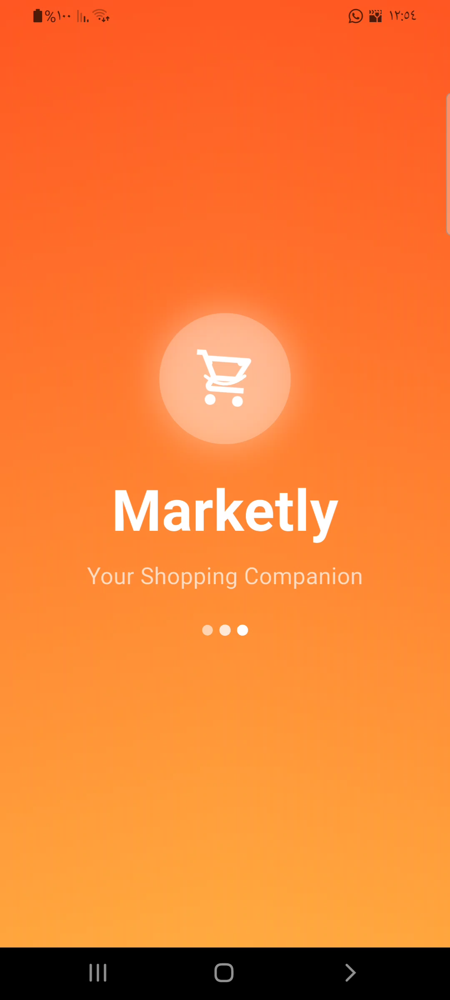</td>
    <td style="text-align:center;">
<strong>Onboarding 1</strong>
</td>
    <td style="text-align:center;">
<strong>Onboarding 2</strong>
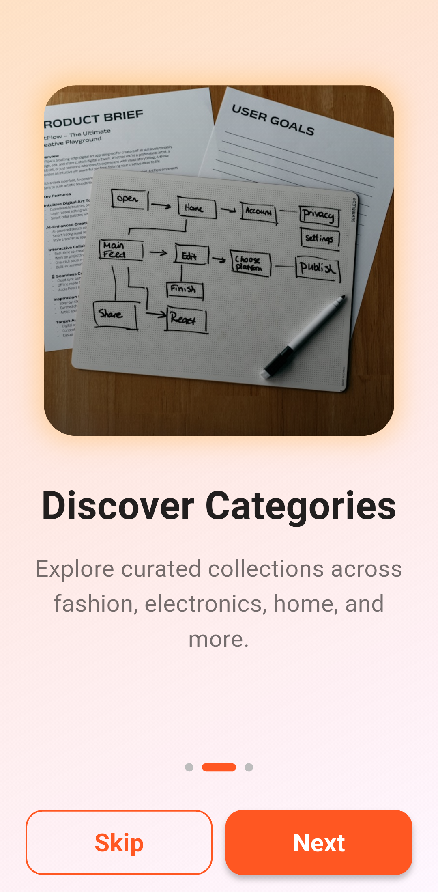</td>
  </tr>
  <tr>
    <td style="text-align:center;">
<strong>Onboarding 3</strong>
</td>
    <td style="text-align:center;">
<strong>Login Screen</strong>
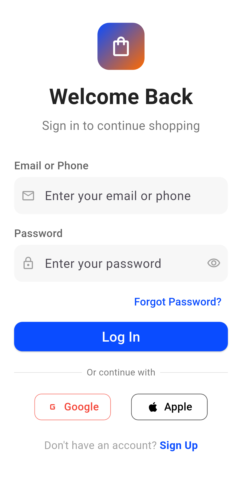</td>
    <td style="text-align:center;">
<strong>Sign Up</strong>
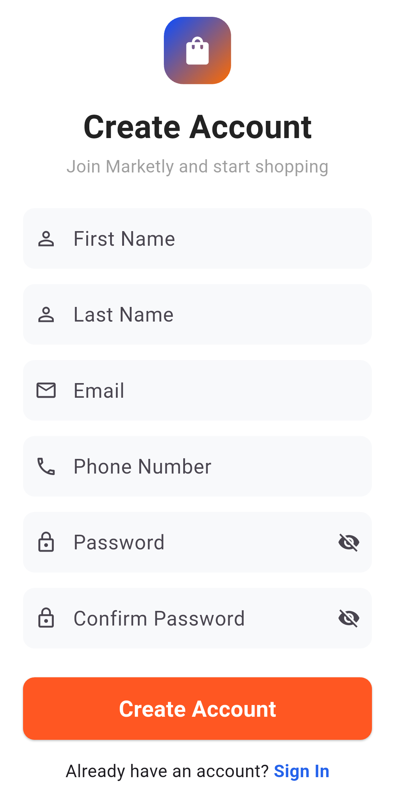</td>
  </tr>
  <tr>
    <td style="text-align:center;">
<strong>Forgot Password</strong>
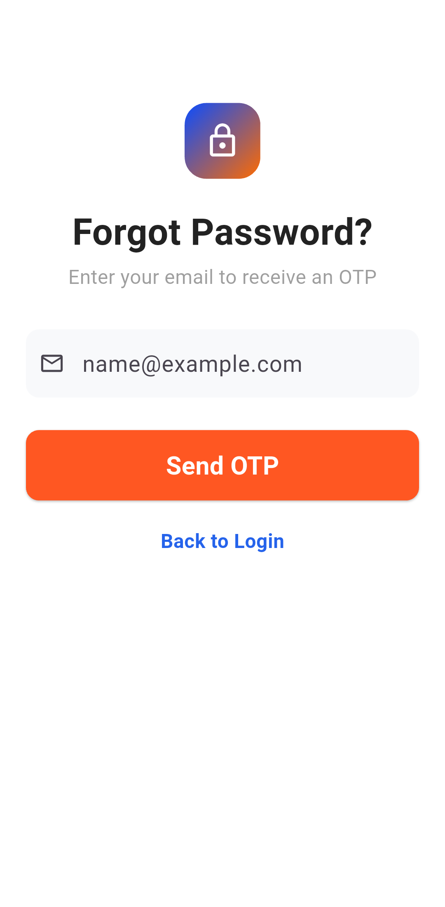</td>
    <td style="text-align:center;">
<strong>Reset Password</strong>
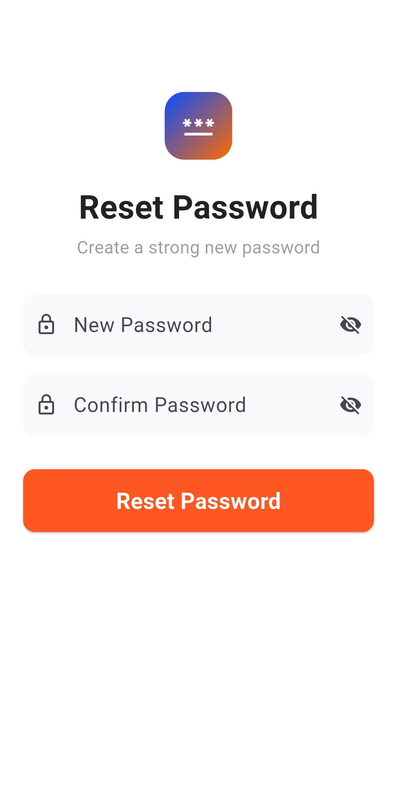</td>
    <td style="text-align:center;">
<strong>Success Login</strong>
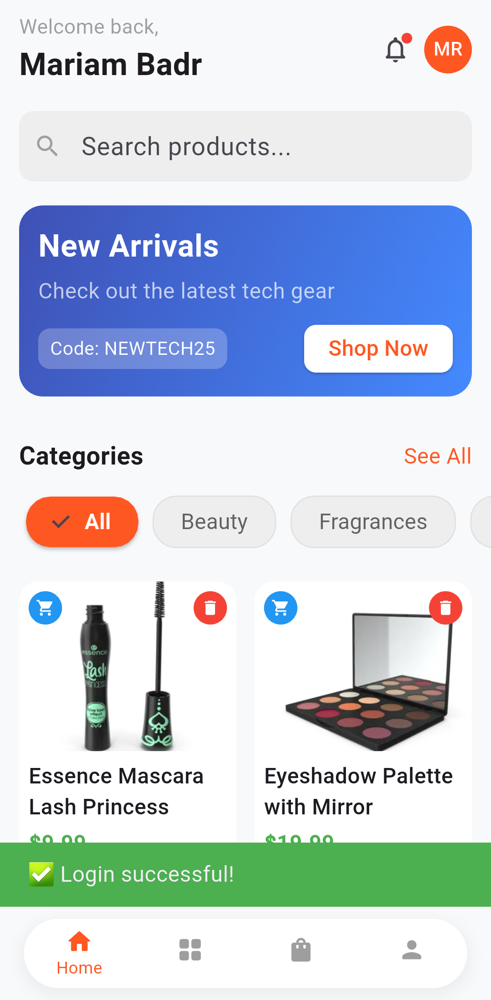</td>
  </tr>
  <tr>
    <td style="text-align:center;">
<strong>Home Screen</strong>
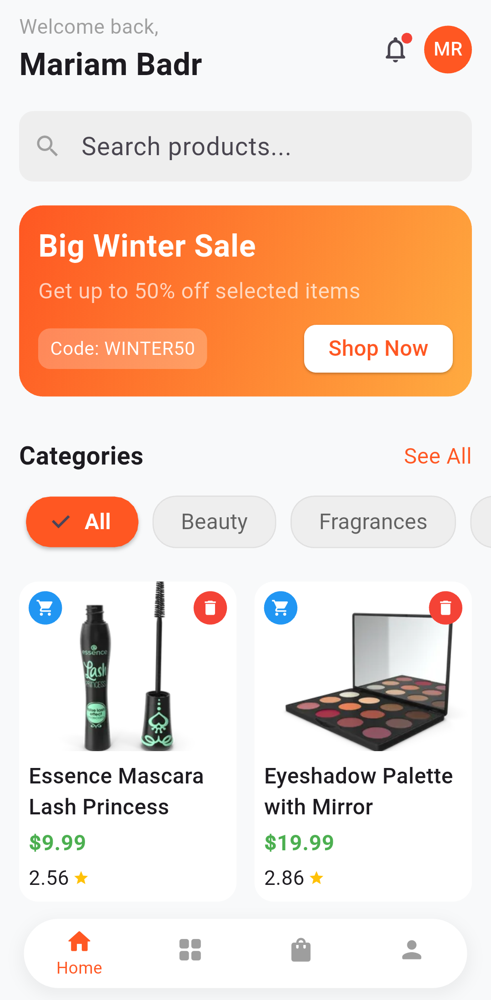</td>
    <td style="text-align:center;">
<strong>Product Details</strong>
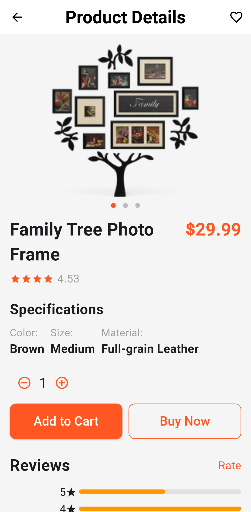</td>
    <td style="text-align:center;">
<strong>Cart Add</strong>
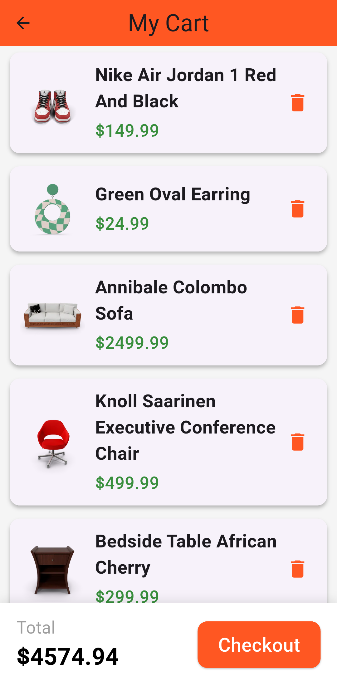</td>
  </tr>
  <tr>
    <td style="text-align:center;">
<strong>Cart Delete</strong>
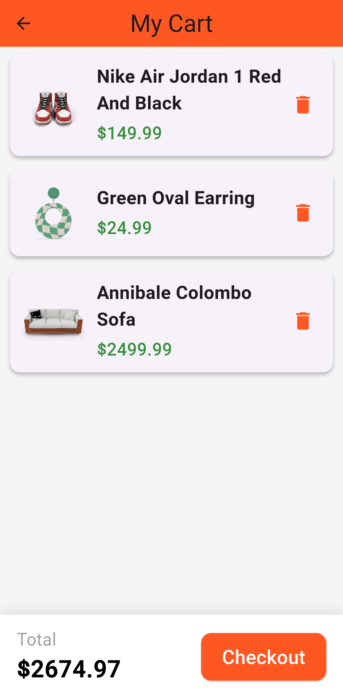</td>
    <td style="text-align:center;">
<strong>Categories</strong>
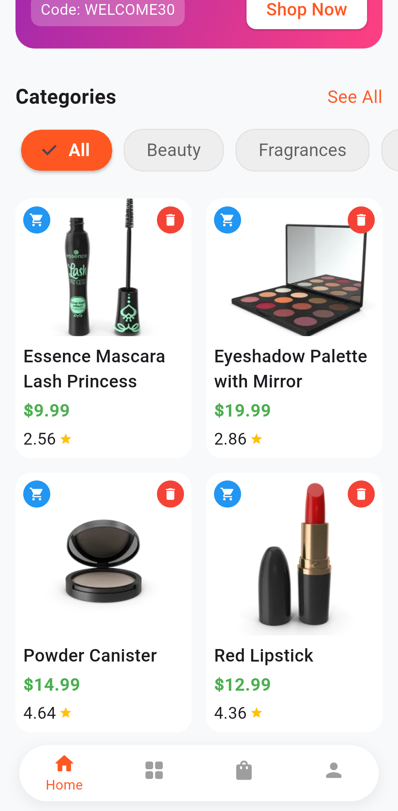</td>
    <td style="text-align:center;">
<strong>Categories (Alt)</strong>
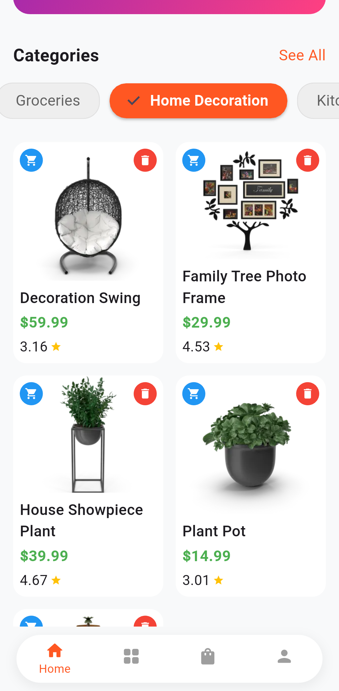</td>
  </tr>
  <tr>
    <td style="text-align:center;">
<strong>Categories Sections</strong>
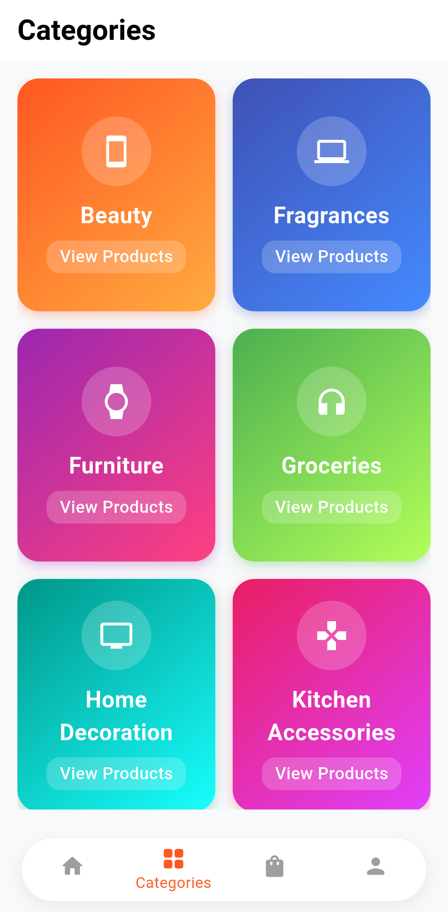</td>
    <td style="text-align:center;">
<strong>Categories Sections (Alt)</strong>
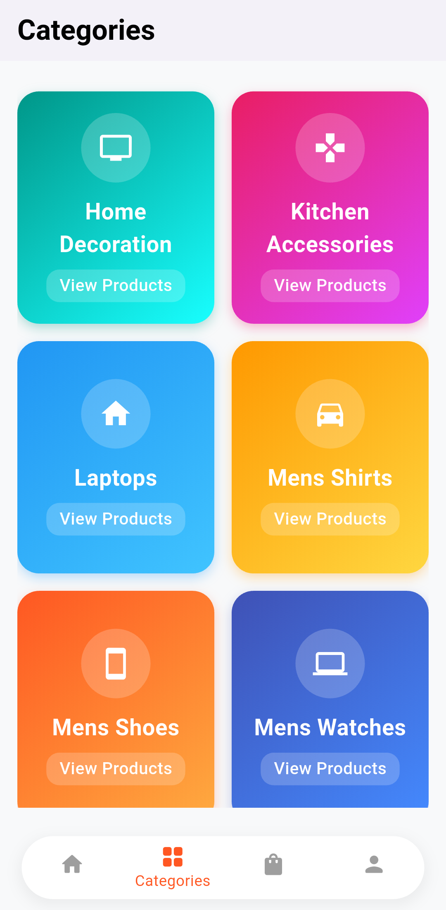</td>
    <td style="text-align:center;">
<strong>Each Category</strong>
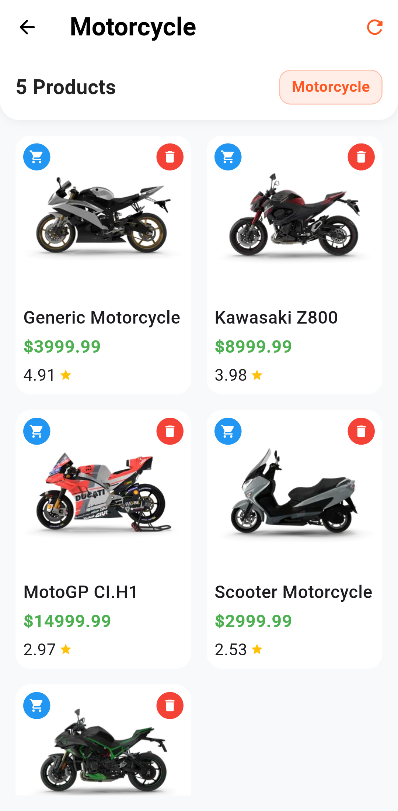</td>
  </tr>
  <tr>
    <td style="text-align:center;">
<strong>Example</strong>
</td>
    <td style="text-align:center;">
<strong>Profile Section</strong>
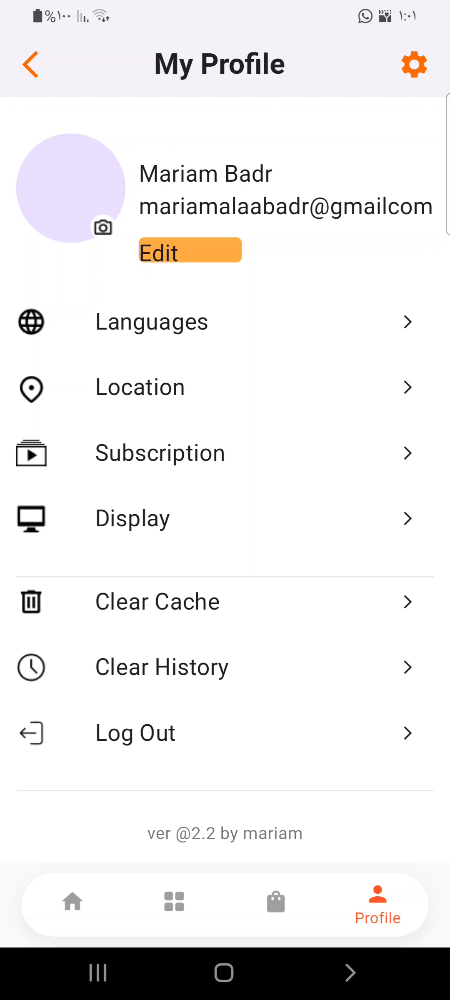</td>
    <td style="text-align:center;">
<strong>Example (duplicate)</strong>
</td>
  </tr>
</table>

---

## 📬 Contact Me

  
  &nbsp;&nbsp;
  
  &nbsp;&nbsp;
  
  &nbsp;&nbsp;
  

